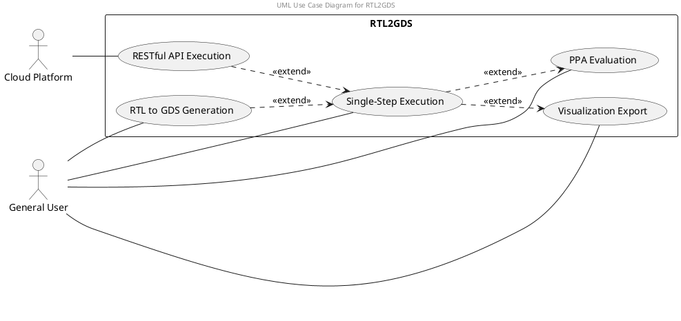
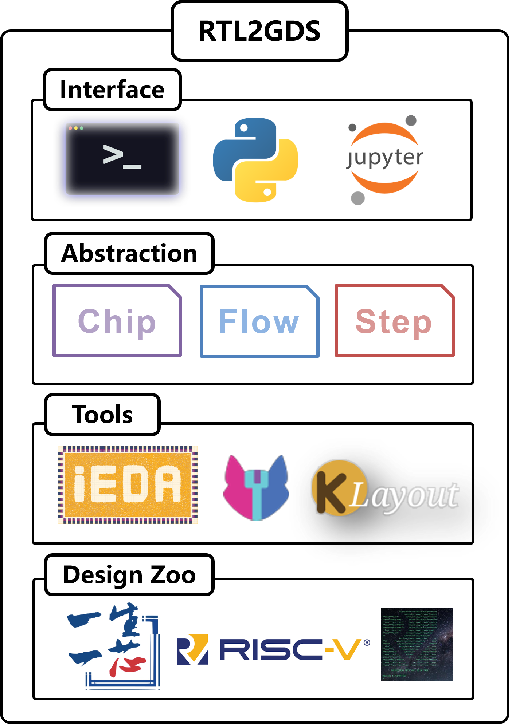
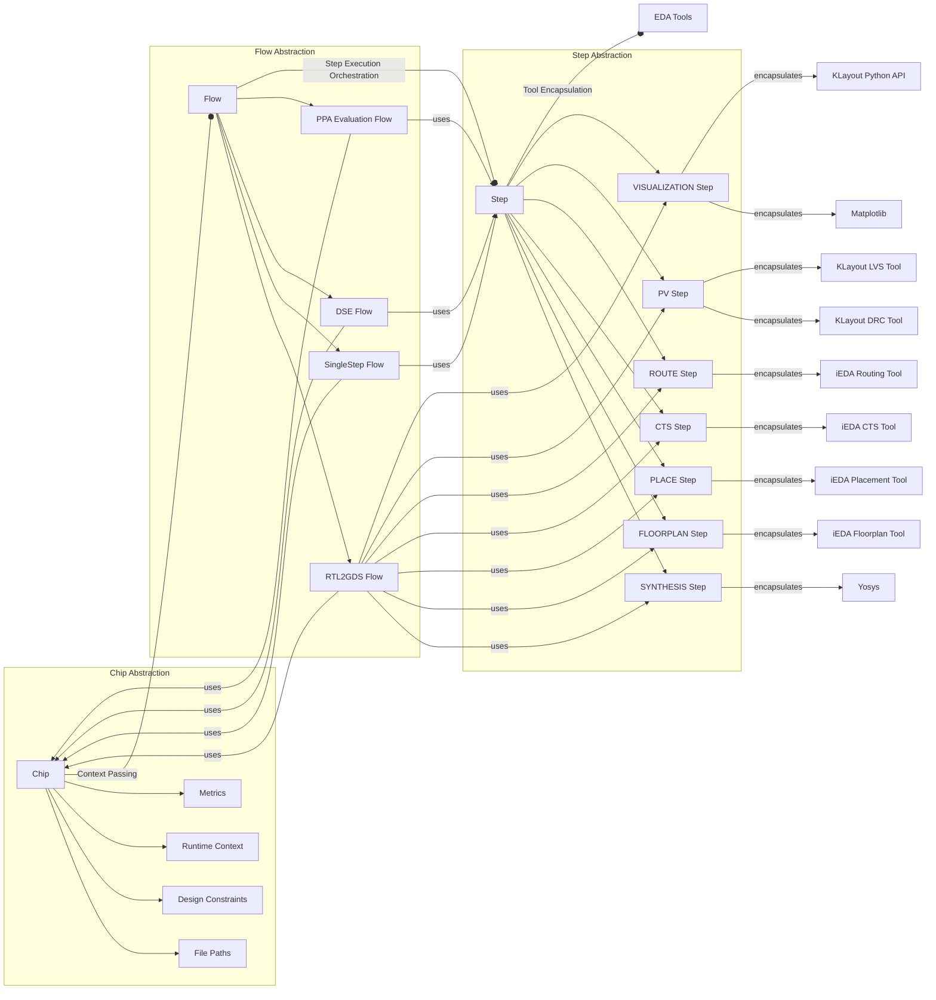

# System Design Document

`RTL2GDS` is an open-sourced RTL to GDSII flow, which wraps pack of open-sourced EDA tools, including yosys-abc, klayout and iEDA which is a comprehensive EDA toolchain for Netlist to GDSII generation. `RTL2GDS` provides a unified interface for users to execute RTL to GDSII flow, including synthesis, floorplanning, placement, routing, and physical verification. It also supports PPA evaluation and layout visualization.

## 1 Background

作为降低芯片设计准入门槛的关键组成部分，开源IP及相关EDA软件想要在市场中获得一席之地需要整合现有生态资源，并充分发挥社区力量。在RTL到GDS流程上，市面上已经存在如 `OpenLane`、`SiliconCompiler` 等优秀开源工具，由商业公司维护，并成功进行若干次流片（参考[开源EDA工具链项目动态表]）。作为后发追赶者，我们整合团队“一生一芯”教学经验、芯片设计流片经验和EDA工具研发经验，本着促进开源芯片社区发展的理念，基于开源EDA构建支持PPA评估和版图生成的EDA工具 `RTL2GDS` 和全流程设计模板库 `Design Zoo`。期望和来自芯片、EDA等社区的爱好者和开发者一起构建与迭代开源芯片生态。

## 2 Requirements Analysis

### 2.1 Identify Users

We have categorized two type of users for now:

1. **General User:** Represents a general user (including OSOC student) interacting with RTL2GDS via command line or GUI.
2. **Cloud Platform:** Abstraction user, represents a cloud service integrating with RTL2GDS via API.

### 2.2 Use-Case View

**Use Cases:**

*   **RTL to GDS Generation:**  The primary use case of generating a GDSII layout from RTL.
*   **Single-Step Execution:** Executing individual steps like synthesis, floorplan, etc.
*   **PPA Evaluation:**  Obtaining Performance, Power, and Area reports.
*   **Visualization Export:** Generating visual outputs like netlist diagrams and layout views.
*   **API-Driven Execution:** Cloud platforms interacting with RTL2GDS programmatically.

### 2.3 Use Case Description

Based on the target users (general users, cloud platforms) and functional requirements, the primary use cases are:

| No. | Name                  | Input                              | Output                   |
| --- | --------------------- | ---------------------------------- | -------------------------|
| UC1 | RTL to GDS Generation | Config.yaml, RTL                   | Reports, GDS             |
| UC2 | Single-Step Execution | Config.yaml, RTL/Netlist/Macro/Def | Reports, Netlist/Def/GDS |
| UC3 | PPA Evaluation        | Config.yaml, RTL/Netlist           | Reports                  |
| UC4 | Visualization Export  | Config.yaml, Def                   | Visualizations in SVG/PNG|
| UC5 | RESTful API Execution | Config.yaml, Def                   | Same as UC2 |

The configuration file (YAML) acts as the primary input for all use cases, controlling the design parameters, constraints, and execution flow. And the RTL2GDS also needs to handle different input types for each step (RTL, Netlist, DEF, Macro) and produce corresponding outputs (Reports, Netlist, DEF, GDS, visualizations in SVG/PNG).

*   **UC1: RTL to GDS Generation:** A user provides RTL design files and a configuration file and initiates the full RTL2GDS flow. The system processes the design through synthesis, floorplanning, placement, routing, and physical verification, generating a GDSII layout and evaluation reports. This caters to the core requirement of converting RTL to GDS.
*   **UC2: Single-Step Execution:** Users can execute individual steps of the RTL2GDS flow, such as synthesis, floorplan, placement, routing, or physical verification. This allows for focused analysis, debugging, and iterative refinement of specific stages.  This is crucial for learning and understanding each step in the flow.
*   **UC3: PPA Evaluation:** Users can obtain performance, power, and area (PPA) evaluation reports at different stages of the flow, particularly after synthesis and placement. This enables RTL design optimization based on early PPA feedback.
*   **UC4: Visualization Export:** Users can generate visual representations of the design, such as netlist connection diagrams and layout top views, to aid in understanding and debugging.  Interactive SVG is desired for netlist views and basic zoomable PNG for layouts.
*   **UC5: RESTful API Execution:** Cloud platforms can interact with RTL2GDS via a REST API to trigger and manage design flows, execute single steps, and retrieve results programmatically (Special requirement for Cloud Platform). This includes asynchronous execution and job management.

---

## 3 Conceptual Design

There are three critical abstractions in RTL2GDS: `Chip` for data management, `Flow` for process orchestration, and `Step` for tool execution.

### 3.1 Logical View

The Logical View describes our three abstractions and their relationships.

**Diagram:**

### 3.2 Chip

`Chip` represents the design itself and facilitating data sharing and process state management. It's the central data container holding all information related to the chip design process. It includes:

*   **Path Setting:** Locations of RTL, netlist, DEF, GDS, reports, configuration files, etc.
*   **Constraint:** Timing constraints (SDC), area constraints, utilization targets, etc., potentially initially managed through SDC files and integrated into the Chip object.
*   **Metrics:**  Performance, Power, Area (PPA) metrics collected at each step. TODO: using a database to store metric trajectories for analysis.
*   **Context:**  State information tracking the progress of the flow, current step, intermediate data, execution parameters and so on. 

`@TODO`: update/snapshot interfaces for the Chip object to manage state changes and rollback.

### 3.3 Flow

`Flow` represents different chip design process flows. It orchestrates the execution of `Step`s and manages the `Chip` object.  Different flow types are:

*   **RTL2GDS:** The complete, linear RTL-to-GDS flow, executing steps sequentially.
*   **SingleStep:**  Executes a single, specified step (e.g., synthesis only).
*   **Cloud Flow:** Single-step execution triggered by Restful APIs.
*   **Signoff:** A focused flow to generate DRC and LVS reports.
*   **PPA Evaluation:**  A focused flow to quickly generate PPA reports at specific stages.
*   **DSE(Design Space Exploration):**  TODO: Potentially explores different design parameters or tool options.

### 3.4 Step
`Step` Represents a single step in the chip design process. It encapsulates the execution of underlying EDA tools. Each `Step` should:

*   **Prepare Inputs:** Ensure the input data are valid for the step. There are two valid types of input: encapsulated input parameters or customized tcl script with a specific EDA tool's name.
*   **Execute:** Run the encapsulated EDA tool to perform the step's function.
*   **Collect Results:** Return metrics and artifacts generated by the step. The artifacts can be text/json files and the metrics are dicts.

Examples of `Step`s include:

*   **Synthesis:** synthesis
*   **Floorplan:** floorplan
*   **NetlistOpt:** fixfanout
*   **Placement:** place (+legalize)
*   **Legalization:** legalize
*   **CTS:** cts
*   **TimingOpt:** drv_opt + hold_opt
*   **Routing:** route
*   **Filler:** filler
*   **STA:** sta
*   **DRC:** drc
*   **LVS:** lvs
*   **Signoff:** sta+drc+lvs
*   **Layout Export:** dump_layout_gds/json

The modular `Step` design allows for easy addition of new steps or replacement of existing ones.

---

## 4 Module Structure

### configuration yaml schema
