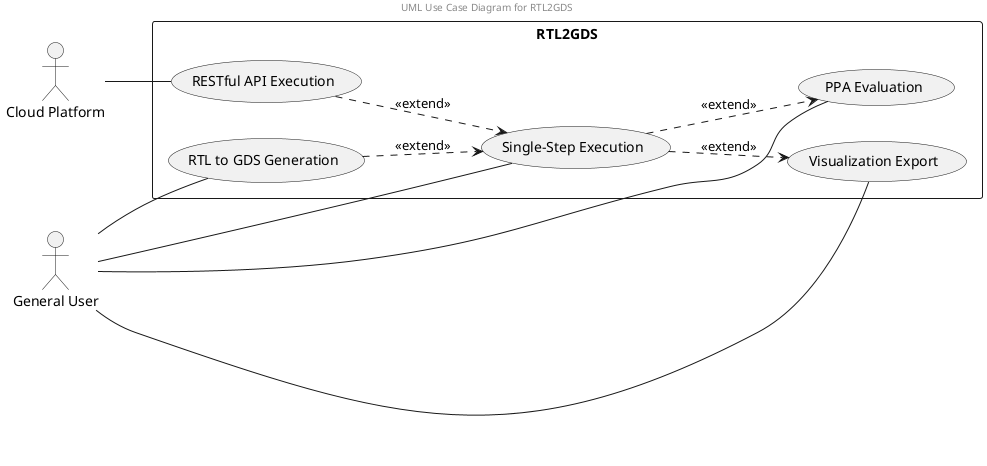
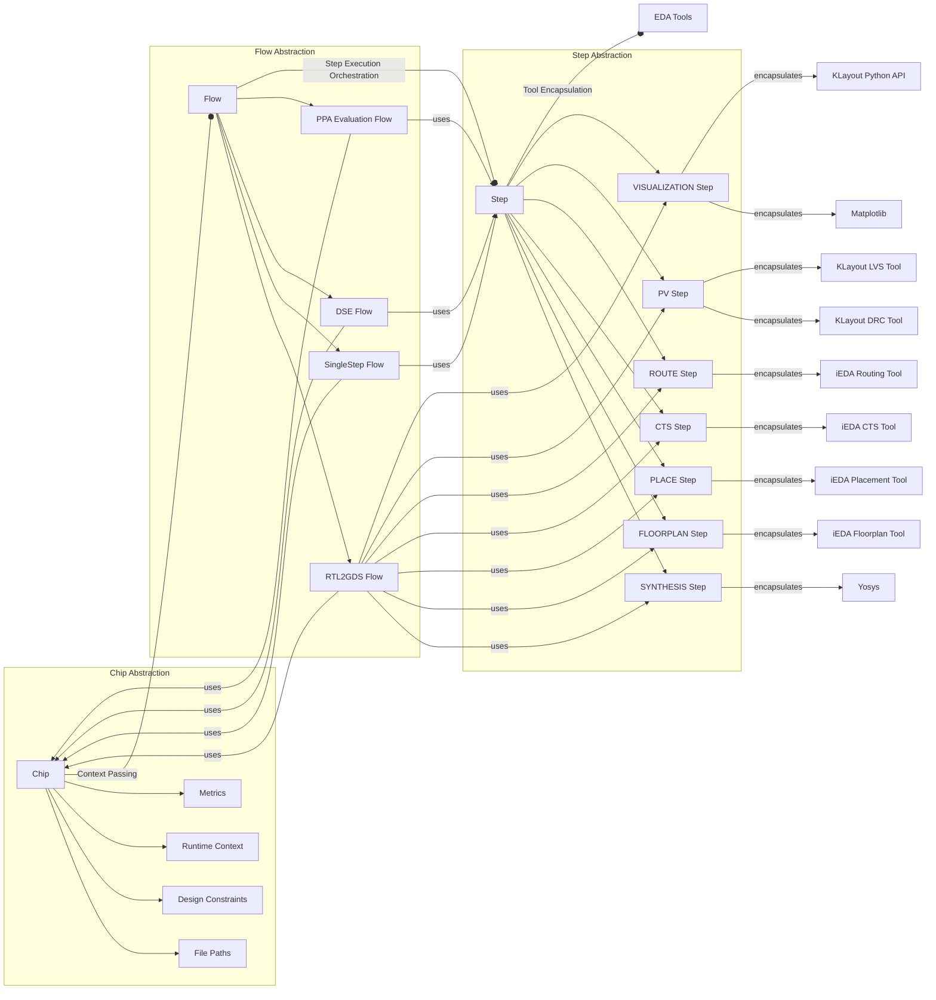
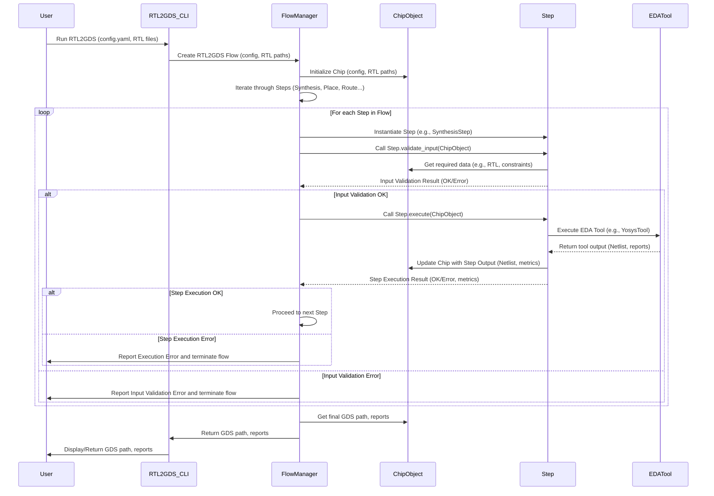
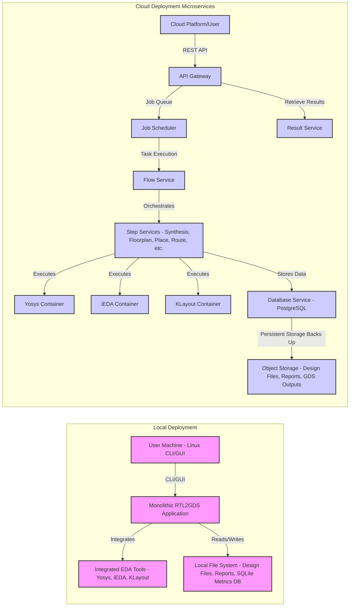

# System Design Document

`RTL2GDS` is an open-sourced RTL to GDSII flow, which wraps pack of open-sourced EDA tools, including yosys-abc, klayout and iEDA which is a comprehensive EDA toolchain for Netlist to GDSII generation. `RTL2GDS` provides a unified interface for users to execute RTL to GDSII flow, including synthesis, floorplanning, placement, routing, and physical verification. It also supports PPA evaluation and layout visualization.

## 1 Background

芯片从设计到制造，越走向下游，资产越重，商业EDA公司含量越高，普通人上手的门槛也越高。作为降低芯片设计准入门槛的关键组成部分，开源IP及相关EDA软件想要在市场中获得一席之地需要整合现有生态资源，并充分发挥社区力量。在RTL到GDS流程上，市面上已经存在如 `OpenLane`、`SiliconCompiler` 等优秀开源工具，由商业公司维护，并成功进行若干次流片（参考[开源EDA工具链项目动态表]）。作为后发追赶者，我们整合CC社区芯片设计流片经验、“一生一芯”教学经验和EDA工具研发经验，本着促进CC社区开源芯片项目发展和 Learning-by-doing 的理念，基于开源iEDA，构建支持PPA评估和版图生成的EDA工具 `RTL2GDS` 和全流程设计模板库 `Design Zoo`。期望和来自芯片、EDA等社区的爱好者和开发者一起构建与迭代开源芯片生态。

## 2 Requirements Analysis

### 2.1 Identify Users

We have categorized two type of users for now:

1. **General User:** Represents a general user (including OSOC student) interacting with RTL2GDS via command line or GUI.
2. **Cloud Platform:** Abstraction user, represents a cloud service integrating with RTL2GDS via API.

### 2.2 Use-Case View

**Use Cases:**

*   **RTL to GDS Generation:**  The primary use case of generating a GDSII layout from RTL.
*   **Single-Step Execution:** Executing individual steps like synthesis, floorplan, etc.
*   **PPA Evaluation:**  Obtaining Performance, Power, and Area reports.
*   **Visualization Export:** Generating visual outputs like netlist diagrams and layout views.
*   **API-Driven Execution:** Cloud platforms interacting with RTL2GDS programmatically.

### 2.3 Use Case Description

Based on the target users (general users, cloud platforms) and functional requirements, the primary use cases are:

| No. | Name                  | Input                              | Output                   |
| --- | --------------------- | ---------------------------------- | -------------------------|
| UC1 | RTL to GDS Generation | Config.yaml, RTL                   | Reports, GDS             |
| UC2 | Single-Step Execution | Config.yaml, RTL/Netlist/Macro/Def | Reports, Netlist/Def/GDS |
| UC3 | PPA Evaluation        | Config.yaml, RTL/Netlist           | Reports                  |
| UC4 | Visualization Export  | Config.yaml, Def                   | Visualizations in SVG/PNG|
| UC5 | RESTful API Execution | Config.yaml, Def                   | Same as UC2 |

The configuration file (YAML) acts as the primary input for all use cases, controlling the design parameters, constraints, and execution flow. And the RTL2GDS also needs to handle different input types for each step (RTL, Netlist, DEF, Macro) and produce corresponding outputs (Reports, Netlist, DEF, GDS, visualizations in SVG/PNG).

*   **UC1: RTL to GDS Generation:** A user provides RTL design files and a configuration file and initiates the full RTL2GDS flow. The system processes the design through synthesis, floorplanning, placement, routing, and physical verification, generating a GDSII layout and evaluation reports. This caters to the core requirement of converting RTL to GDS.
*   **UC2: Single-Step Execution:** Users can execute individual steps of the RTL2GDS flow, such as synthesis, floorplan, placement, routing, or physical verification. This allows for focused analysis, debugging, and iterative refinement of specific stages.  This is crucial for learning and understanding each step in the flow.
*   **UC3: PPA Evaluation:** Users can obtain performance, power, and area (PPA) evaluation reports at different stages of the flow, particularly after synthesis and placement. This enables RTL design optimization based on early PPA feedback.
*   **UC4: Visualization Export:** Users can generate visual representations of the design, such as netlist connection diagrams and layout top views, to aid in understanding and debugging.  Interactive SVG is desired for netlist views and basic zoomable PNG for layouts.
*   **UC5: RESTful API Execution:** Cloud platforms can interact with RTL2GDS via a REST API to trigger and manage design flows, execute single steps, and retrieve results programmatically (Special requirement for Cloud Platform). This includes asynchronous execution and job management.

---

## 3 Conceptual Design

There are three critical abstractions in RTL2GDS: `Chip` for data management, `Flow` for process orchestration, and `Step` for tool execution.

### 3.1 Logical View

The Logical View describes our three abstractions and their relationships.

**Diagram:**

### 3.2 Chip

`Chip` represents the design itself and facilitating data sharing and process state management. It's the central data container holding all information related to the chip design process. It includes:

*   **Path Setting:** Locations of RTL, netlist, DEF, GDS, reports, configuration files, etc.
*   **Constraint:** Timing constraints (SDC), area constraints, utilization targets, etc., potentially initially managed through SDC files and integrated into the Chip object.
*   **Metrics:**  Performance, Power, Area (PPA) metrics collected at each step. TODO: using a database to store metric trajectories for analysis.
*   **Context:**  State information tracking the progress of the flow, current step, intermediate data, execution parameters and so on. 

`@TODO`: update/snapshot interfaces for the Chip object to manage state changes and rollback.

### 3.3 Flow

`Flow` represents different chip design process flows. It orchestrates the execution of `Step`s and manages the `Chip` object.  Different flow types are:

*   **RTL2GDS:** The complete, linear RTL-to-GDS flow, executing steps sequentially.
*   **SingleStep:**  Executes a single, specified step (e.g., synthesis only).
*   **Cloud Flow:** Single-step execution triggered by Restful APIs.
*   **Signoff:** A focused flow to generate DRC and LVS reports.
*   **PPA Evaluation:**  A focused flow to quickly generate PPA reports at specific stages.
*   **DSE(Design Space Exploration):**  TODO: Potentially explores different design parameters or tool options.

### 3.4 Step
`Step` Represents a single step in the chip design process. It encapsulates the execution of underlying EDA tools. Each `Step` should:

*   **Validate Input:** Ensure the input data are valid for the step. There are two valid types of input: encapsulated input parameters or customized tcl script with a specific EDA tool's name.
*   **Execute:** Run the encapsulated EDA tool to perform the step's function.
*   **Update:** Return results and metrics generated by the step. The results can be text files or dicts and the metrics are dicts.

Examples of `Step`s include:

*   **Synthesis:** synthesis
*   **Floorplan:** floorplan
*   **NetlistOpt:** fixfanout
*   **Placement:** place (+legalize)
*   **Legalization:** legalize
*   **CTS:** cts
*   **TimingOpt:** drv_opt + hold_opt
*   **Routing:** route
*   **Filler:** filler
*   **STA:** sta
*   **DRC:** drc
*   **LVS:** lvs
*   **Signoff:** sta+drc+lvs
*   **Layout Export:** dump_layout_gds/json

The modular `Step` design allows for easy addition of new steps or replacement of existing ones.

---

## 4 Module Structure

Describes the concrete realization of the logical view, focusing on the software modules, code organization, and technology choices.

**Diagram:**

*(For the Implementation View, we can describe the module structure and technologies. A UML Component Diagram could be considered later if needed for more detailed implementation planning.)*

**Description:**

The Implementation View describes how the logical components will be realized in Python code, including module organization, technology choices, and key implementation decisions.

*   **Package Structure:** We can organize the Python code into packages reflecting the logical view:
    *   `rtl2gds/chip/`:  Classes and modules related to the `Chip` abstraction (e.g., `chip.py`, `chip_data.py`, `metrics.py`).
    *   `rtl2gds/flow/`: Classes and modules for different `Flow` types (e.g., `rtl2gds_flow.py`, `single_step_flow.py`, `flow_manager.py`).
    *   `rtl2gds/step/`: Classes and modules for individual `Step` implementations (e.g., `synthesis_step.py`, `floorplan_step.py`, base `step.py` class, potentially a `tool_step.py` abstract class for tool encapsulation).
    *   `rtl2gds/tool_wrappers/`: Modules to wrap specific EDA tools (e.g., `yosys_wrapper.py`, `ieda_wrapper.py`, `klayout_wrapper.py`). This further isolates tool-specific code.
    *   `rtl2gds/config/`: Modules for configuration file handling (YAML parsing, validation, etc.).
    *   `rtl2gds/api/`: Modules for the REST API (using a framework like Flask or FastAPI).
    *   `rtl2gds/visualization/`: Modules for visualization generation (using Matplotlib, KLayout Python API).
    *   `rtl2gds/db/`: Modules for database interaction (using SQLite or another suitable database as suggested in Q&A).
    *   `rtl2gds/cli/`: Command-line interface entry point using `argparse` or `click`.
    *   `rtl2gds/utils/`: Utility functions and helper modules.

*   **Technology Choices:**
    *   **Programming Language:** Python (as required).
    *   **Dependency Management:** `uv` (as decided in Q&A).  Use `uv` for managing Python dependencies and virtual environments.
    *   **Configuration File Format:** YAML (as defined). Use a YAML parsing library like `PyYAML`.  Implement validation based on schema (as suggested in Q&A).
    *   **Database:** SQLite initially for simplicity and file-based persistence of metrics and potentially `Chip` state for "resume from breakpoint" (as discussed in Q&A). Consider more scalable options like PostgreSQL for future cloud deployments. Use an ORM like SQLAlchemy for database interaction.
    *   **REST API Framework (for Cloud Platform):** FastAPI or Flask (FastAPI is generally preferred for modern APIs).
    *   **Visualization Libraries:** Matplotlib for basic plots, KLayout Python API for layout and DRC visualization. Consider SVG generation libraries for interactive netlist views.
    *   **EDA Tool Interaction:**  subprocess for command-line EDA tools (Yosys, iEDA command-line tools).  KLayout Python API for KLayout functionalities. Consider Python bindings for iEDA if available for more direct interaction in the future.
    *   **Error Handling:** Python's exception handling mechanisms.  Implement specific exception types for tool failures, configuration errors, etc.  Signal handling for subprocess crashes (as suggested in Q&A). Logging framework (e.g., `logging` module) for detailed logging.

*   **Key Implementation Decisions:**
    *   **Step Abstraction Implementation:** Implement an abstract base class `Step` with `validate_input()`, `execute()`, and `update_chip()` methods. Concrete step classes will inherit from this and implement tool-specific logic.
    *   **Chip Object Management:** Design the `Chip` object to be mutable with controlled update mechanisms and snapshot capabilities (as suggested in Q&A).  Consider using property setters and getters for controlled access to `Chip` attributes.
    *   **Data Persistence:** Implement YAML-based persistence for minimal `Chip` state to support "resume from breakpoint". Implement database interaction for metrics and more advanced data analysis.
    *   **API Design:** Design REST API endpoints for triggering flows, single steps, retrieving results, and status monitoring. Follow RESTful principles.  Support asynchronous execution and job IDs (as required for cloud platform). Machine-readable output formats (JSON, YAML) for reports (as required).
    *   **Visualization Decoupling:** Design visualization as a decoupled component, potentially a separate frontend application or Jupyter Notebook integration (as suggested in Q&A).
    *   **Testing:** Implement unit tests for individual modules and integration tests for flows.  Establish a Golden Reference (Design Zoo examples) for regression testing (as required). Implement fuzz testing for robustness (as required). CI/CD pipeline based on GitLab (as required).

**Analysis:**

*   This implementation view provides a concrete plan for developing RTL2GDS in Python.
*   The package structure promotes modularity and maintainability.
*   Technology choices align with modern Python development practices and address the requirements and suggestions from the initial document and Q&A.
*   The key implementation decisions address crucial aspects like step abstraction, data management, API design, and testing, setting a solid foundation for development.
*   The use of `uv`, YAML, SQLite, FastAPI/Flask, Matplotlib, KLayout API, and subprocess provides a practical and efficient technology stack for the project.

---

## 5 Process View

Describes the dynamic aspects of the system, focusing on the runtime behavior, workflows, and data flow.

**Diagram:**

**Description:**

The Process View describes the runtime behavior of RTL2GDS, focusing on a typical RTL-to-GDS flow execution.

*   **Workflow:**
    1.  **User Initiation:** The user starts RTL2GDS execution via the CLI (or API in cloud deployment), providing a configuration file and RTL design files.
    2.  **Flow Creation:** The `RTL2GDS_CLI` (or API Gateway) creates a `FlowManager` instance, specifying the flow type (RTL2GDS, SingleStep, etc.) and passing the configuration and input paths.
    3.  **Chip Initialization:** The `FlowManager` initializes a `ChipObject`, populating it with initial data from the configuration and input files (file paths, design constraints, etc.).
    4.  **Step Iteration:** The `FlowManager` iterates through the steps defined in the selected flow (e.g., Synthesis, Place, Route for RTL2GDS flow).
    5.  **Step Execution:** For each step:
        *   The `FlowManager` instantiates the corresponding `Step` object (e.g., `SynthesisStep`).
        *   **Input Validation:** The `FlowManager` calls the `Step.validate_input(ChipObject)` method. The `Step` retrieves necessary data from the `ChipObject` and performs validation checks.
        *   **Execution:** If input validation is successful, the `FlowManager` calls `Step.execute(ChipObject)`. The `Step` interacts with the encapsulated EDA tool (e.g., `YosysTool`, `iEDATools`, `KLayoutTool`), executes the tool, and obtains output (netlist, reports, etc.).
        *   **Chip Update:** The `Step` updates the `ChipObject` with the results of the step execution (netlist, updated metrics, etc.).
        *   **Result Reporting:** The `Step` returns the execution result (success/error) and metrics to the `FlowManager`.
    6.  **Error Handling:** If input validation or step execution fails at any point, the `FlowManager` reports the error to the user and terminates the flow.
    7.  **Final Output:** After successful completion of all steps in the flow, the `FlowManager` retrieves the final outputs (GDS path, reports) from the `ChipObject` and returns them to the `RTL2GDS_CLI` (or API Gateway) for the user.
    8.  **Result Delivery:** The `RTL2GDS_CLI` presents the final outputs (GDS path, reports) to the user. In cloud deployment, the API Gateway provides access to results via the Result Service.

---

## 6 Deployment View

Describes the physical deployment of the system components, considering different environments and scalability.

**Diagram:**

**Description:**

The Deployment View describes how RTL2GDS can be deployed in different environments, considering local execution and cloud deployment with potential microservice architecture.

*   **Local Deployment:**
    *   **Environment:** User's local machine (Linux assumed as per Q&A).
    *   **Deployment Method:**  Installed directly on the user's OS, or via a Docker container (as suggested in Q&A).  `uv` managed Python environment for dependencies.
    *   **Components:**  A monolithic RTL2GDS application containing all modules (`Chip`, `Flow`, `Step`, UI/CLI). EDA tools (Yosys, iEDA, KLayout) are assumed to be installed locally or provided within a container.
    *   **User Interaction:** Command-line interface (CLI) for most users. Potential for a simple GUI in the future for ysyx students.
    *   **Data Storage:** Local file system for design files, reports, intermediate data. SQLite database file for metrics (also local file system).

*   **Cloud Deployment (Microservices Architecture):**
    *   **Environment:** Cloud platform (e.g., Kubernetes as suggested in Q&A).
    *   **Deployment Method:**  Containerized microservices deployed on Kubernetes. Docker images for each service (as suggested in Q&A).
    *   **Components:**
        *   **API Gateway:**  Entry point for external API requests. Handles authentication, routing, and request management. (e.g., using Kong, Nginx).
        *   **Job Scheduler:** Manages and schedules RTL2GDS jobs. Queues jobs, distributes tasks to worker services. (e.g., using Celery, Redis, Kubernetes Jobs).
        *   **Flow Service:**  Orchestrates the overall RTL2GDS flow. Receives job requests, breaks down flows into steps, and communicates with Step Services.
        *   **Step Services:**  Individual microservices for each `Step` (Synthesis Service, Floorplan Service, Place Service, Route Service, etc.).  Each service encapsulates the execution of specific EDA tools within containers.  Scalable independently.
        *   **Database Service:**  Centralized database for storing metrics, job status, user data, etc. (e.g., PostgreSQL).
        *   **Object Storage:** Cloud object storage (e.g., AWS S3, Google Cloud Storage) for persistent storage of design files, reports, GDS outputs.
        *   **Result Service:** Provides API endpoints for retrieving job results, reports, and GDS files.

    *   **User Interaction:** Cloud platform interacts via REST API through the API Gateway.
    *   **Scalability & Resilience:** Microservices architecture enables horizontal scaling of individual services based on load.  Increased resilience through service isolation and redundancy.
    *   **Inter-service Communication:** Asynchronous communication via message queues (e.g., RabbitMQ, Kafka) or direct synchronous calls (REST/gRPC) within the cluster.

### configuration yaml schema
